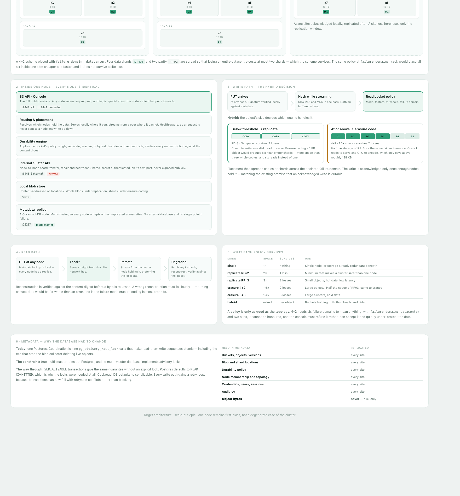

# Scaling Pail out

A plan for turning Pail into a distributed object store: one node or a thousand,
across multiple datacentres, with replication and erasure coding chosen per
bucket, and no single point of failure anywhere.

This is a large piece of work. The document exists to make the size and the
decisions visible before any of it starts.



---

## 1. What was asked for

| Requirement | Consequence |
| ----------- | ----------- |
| Survive a host dying | Redundancy at every layer, including metadata |
| More total capacity | Shared-nothing: each host's disks contribute |
| More throughput | Any node serves any request |
| Local disks only | No shared filesystem to lean on |
| Replication **and** erasure coding, **per bucket** | Two storage engines, and a policy layer above them |
| Small objects replicated below a threshold | A third path, chosen per object by size |
| True multi-master metadata | Postgres has to go |
| 1 node to unbounded | Placement must be correct at both extremes |
| Multiple datacentres | Placement must understand failure domains and latency |

Taken together this is a distributed storage system of the same class as MinIO
or Ceph.

**That is worth saying plainly before starting.** MinIO in particular already
does almost exactly this list — erasure coding, per-bucket policy, multi-site,
S3 API — and is mature, tested at scale, and open source. Building this instead
is a defensible choice if the point is control, learning, or a licence
constraint, but it is a six-to-twelve month commitment for one person, and the
dangerous parts are dangerous in ways that cost data rather than uptime.

Everything below assumes the decision to build it has been made deliberately.

---

## 2. What survives from the current design

More than expected. All cross-request coordination already runs through the
database rather than process memory, so nothing in the object, bucket, session,
credential or audit layers assumes a single node.

**One thing is node-local: the blob store.** Its entire surface is five methods
— `Put`, `Open`, `Concat`, `Remove`, `Usage` — across ten call sites. That is
the seam the whole distributed design fits behind.

**One thing has to be rebuilt: the coordination model.** Nine call sites use
`pg_advisory_xact_lock`, and multi-master databases do not implement it. This is
the critical path, and section 3 covers it.

---

## 3. The metadata problem

True multi-master rules out Postgres. It is single-primary by design; every
"multi-master Postgres" is either an extension with sharp edges or a different
database wearing the wire protocol.

### The obstacle

Coordination today is nine advisory locks:

| Site | Protects | If it breaks |
| ---- | -------- | ------------ |
| `blobs.go` ×2 | Blob garbage collection | **Silent data loss** — live objects deleted |
| `objects.go` ×2 | Per-key write serialisation | Leaked blobs, disk never reclaimed |
| `multipart.go` ×2 | Part replacement | Leaked part blobs |
| `versions.go` | Restore | Corrupt version history |
| `migrate.go` ×2 | Schema migration | Two nodes applying the same DDL |

Advisory locks are a Postgres feature. CockroachDB, Yugabyte and TiDB do not
have them.

### The way through

**CockroachDB**, with the locks replaced by `SERIALIZABLE` transactions.

This is not merely a substitution — it is arguably an improvement. The advisory
locks exist to make read-then-write sequences atomic, which is exactly what
serializable isolation guarantees without an explicit lock. Cockroach runs
`SERIALIZABLE` by default, where Postgres defaults to `READ COMMITTED` and made
the locks necessary.

What it costs: every one of those nine sites needs rewriting and re-proving,
including the blob GC race that took a deliberate design to get right the first
time. Transactions can now fail with retryable serialization errors, so every
write path needs a retry loop. And the test suite has to run against Cockroach
as well.

Cockroach also brings multi-region natively — survive-datacentre configurations,
regional tables, follower reads — which is otherwise a project in itself.

**Alternatives considered:**

- *Yugabyte* — closer Postgres compatibility, smaller ecosystem. Worth a spike.
- *Postgres per datacentre with our own coordination* — replaces one hard
  problem with a harder one.
- *No database; metadata beside the objects, Raft-replicated* — what MinIO does.
  Removes the dependency entirely, and is a very large build on its own.

**Recommendation: CockroachDB.** The migration is the first real phase and the
main risk, and it should be proven before anything else is built on it.

---

## 4. Storage design

### Four modes, chosen per bucket

| Mode | Overhead | Survives | For |
| ---- | -------- | -------- | --- |
| `single` | ×1 | nothing | One node, or storage already redundant beneath |
| `replicate` | ×RF | RF−1 losses | Small objects, hot data, lowest latency |
| `erasure` | (k+m)/k | m losses | Large objects; half the space of RF=3 for the same tolerance |
| `hybrid` | mixed | per object | **Replication below a size threshold, erasure coding at or above it** |

**Hybrid is a first-class mode, not a side effect of setting a threshold.** It is
what most buckets should actually use, and it needs both sets of parameters
configured and validated together.

The reason it exists: erasure coding a 1 KB object produces k+m near-empty shards
plus placement metadata — more space than three whole copies, and k disk reads to
serve instead of one. Replication is cheaper and faster below roughly 128 KB;
erasure coding is dramatically cheaper above it. A bucket holding both thumbnails
and video is served badly by either alone. MinIO and Ceph both do this.

### Per-bucket policy

```
durability:
  mode: single | replicate | erasure | hybrid
  replication_factor: 3           # replicate, and hybrid below the threshold
  erasure: { data: 4, parity: 2 } # erasure, and hybrid at or above it
  small_object_threshold: 131072  # hybrid only
  failure_domain: node | rack | datacenter
  placement: local | spread
```

**A policy is only as good as the topology.** A 4+2 scheme needs six failure
domains to mean anything: with `failure_domain: datacenter` and two sites it
cannot be honoured, and the console has to refuse it rather than accept it and
quietly under-protect the data.

`failure_domain` is what makes multi-datacentre real: it declares what the
scheme must survive. `datacenter` means shards are placed so that losing a whole
site loses at most `m` of them.

### Content addressing survives

Blobs are addressed by the SHA-256 of their content today, and that continues to
hold. Placement keys on the digest, so identical content still converges on one
blob cluster-wide — deduplication works across the whole cluster rather than
being lost to sharding.

Under erasure coding the unit on disk changes from a file to a set of shards,
but the digest still names the object, and reconstruction is verified against it.

### Placement

Topology-aware weighted rendezvous hashing over a node / rack / datacentre
hierarchy.

Rendezvous rather than a hash ring: no virtual nodes to tune, minimal movement
when membership changes, and weighting for uneven disks falls out naturally.
Hierarchy is what lets a policy say "these six shards must span three
datacentres".

The single-node case must remain first-class: one node, `RF=1`, EC off should
behave exactly as it does today, with the placement layer resolving to "here".

---

## 5. Multiple datacentres

The hardest requirement, and the one most often underestimated.

Cross-site links are slow and expensive relative to a rack. A design that treats
all nodes as equal will erasure-code an object across three continents and take
a second to serve it.

What has to be decided per bucket:

- **Synchronous or asynchronous across sites.** Synchronous means a write is not
  acknowledged until remote sites hold it: safe, and as slow as the furthest
  link. Asynchronous acknowledges locally and replicates after: fast, with a
  window in which a site loss loses recent writes.
- **Read affinity.** Serve from the nearest site holding the data.
- **Failure-domain-aware placement**, so a scheme that claims to survive losing
  a datacentre actually does.

This deserves to be its own phase, and should not be attempted before
single-site clustering is solid.

---

## 6. Phases

Ordered so each is independently useful, and the risky ones come early enough to
change course.

| # | Phase | Points |
| - | ----- | ------ |
| 0 | Leader election for maintenance sweeps | 3 |
| 1 | Replace advisory locks with serializable transactions | 13 |
| 2 | Move to CockroachDB, whole suite green | 13 |
| 3 | Node identity, topology and membership | 8 |
| 4 | Topology-aware placement engine | 13 |
| 5 | Internal node API, cross-node read and write | 13 |
| 6 | Replication with per-bucket factor | 8 |
| 7 | Erasure coding | 21 |
| 8 | Per-bucket durability policy and size threshold | 8 |
| 9 | Repair, rebalance and scrub | 21 |
| 10 | Multi-datacentre placement and replication | 21 |
| 11 | Multipart upload across nodes | 5 |
| 12 | Request routing and cluster console | 13 |
| 13 | Cluster operations and documentation | 8 |
| | **Total** | **168** |

For scale: everything built so far is 174 points. This is a second system of the
same size as the first.

### The three that carry the risk

**Phase 1–2, the database migration.** Everything else depends on it, and it
rewrites the code that prevents silent data loss. It should be proven, with the
full compatibility suite green, before phase 3 starts.

**Phase 7, erasure coding.** Reconstruction has to be correct under every
combination of missing shards, and verified against the content digest. A subtle
bug here returns corrupt data rather than an error.

**Phase 9, repair and rebalance.** Where distributed storage systems have their
worst failures. It needs a harness that kills nodes mid-write and mid-repair as
a matter of course, not as an afterthought.

---

## 7. What this does to the product

Pail today is one container, one database, one disk, with a README that leads
with what it deliberately does not do. Afterwards it is a distributed storage
system with placement policy, erasure coding, repair and multi-site replication
— a different product, with different operational demands and a different
audience.

The single-node deployment must stay genuinely first-class, not a degenerate
case of the cluster. That is a design constraint on every phase, and the reason
phase 4 has to resolve cleanly to "here" when there is only one node.
